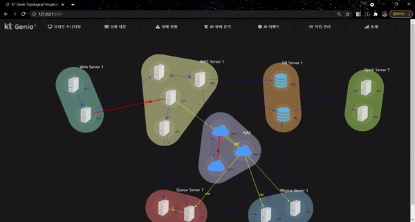
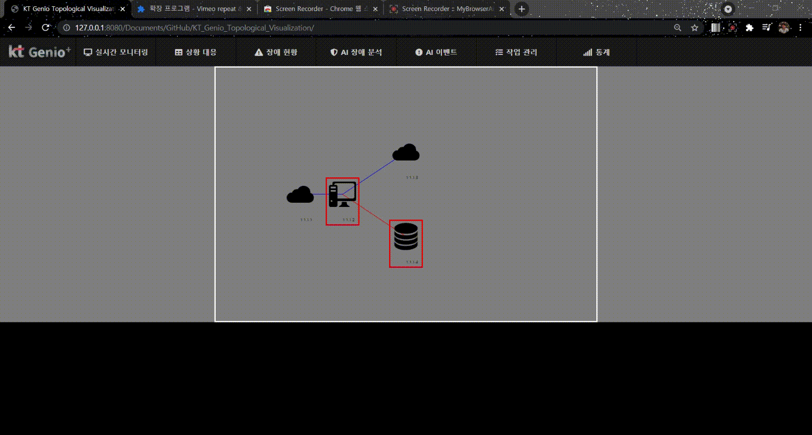
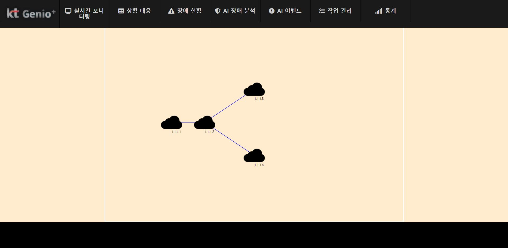

# KT Genio Topological Visualization

## Perform Logs
- 2021-07-29

- 2021-07-28

- 2021-07-27

- 2021-07-26

- 2021-07-19

- 2021-07-16


## Sources

http://simpleicon.com/wp-content/uploads/cloud-9-64x64.png

http://simpleicon.com/wp-content/uploads/monitor_1-64x64.png

## Troubleshooting
1. CORS Policy: https://velog.io/@takeknowledge/%EB%A1%9C%EC%BB%AC%EC%97%90%EC%84%9C-CORS-policy-%EA%B4%80%EB%A0%A8-%EC%97%90%EB%9F%AC%EA%B0%80-%EB%B0%9C%EC%83%9D%ED%95%98%EB%8A%94-%EC%9D%B4%EC%9C%A0-3gk4gyhreu 

html 파일을 로컬환경에서 크롬 브라우저로 실행시킬 때, 다음 에러가 뜨면서 json 파일을 불러오지 못함.
```
from origin 'null' has been blocked by CORS policy: Cross origin requests are only supported for protocol schemes: http, data, chrome, chrome-extension, chrome-untrusted, https.
```

이 경우, 
** VSCode Live Server Plugin 사용**

```
npm install http-server -g
```
로 http-server를 설치한 뒤,

```
npx http-server
```
로 가서 [http://127.0.0.1:8080](http://127.0.0.1:8080) 로 접속.
